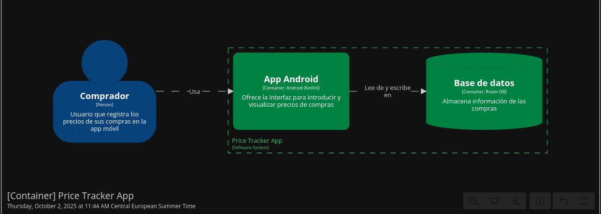

# Registro de Precios

Este proyecto es una app móvil para llevar un seguimiento de los precios de la compra. Su objetivo es registrar los precios de cada compra para permitir comparaciones en compras futuras.

El desarrollo de esta app sirve como un ejercicio práctico para aplicar y documentar principios de diseño y arquitectura de software de manera metódica y explícita.

## Arquitectura y Capacidades Principales

La arquitectura general del sistema se describe visualmente a través de los diagramas del Modelo C4.

El [Diagrama de Contexto](./docs/diagrams/c4/context-diagram.dsl) muestra a alto nivel cómo nuestro servicio interactúa con su entorno.

## Requisitos no Funcionales
Los criterios de calidad y rendimiento que debe cumplir el sistema se definen en el documento de [Requisitos No Funcionales](./docs/NFRs.md). Estos requisitos sirven como base para la toma de decisiones técnicas.

## Principios de Diseño
El desarrollo se guiará por los siguientes principios arquitectónicos:

    Arquitectura Hexagonal
    Domain-Driven Design (DDD)
    Test-Driven Development (TDD) / Behavior-Driven Development (BDD)

## Decisiones de Arquitectura

## Contribución

Este proyecto tiene una guía de contribución que detalla el flujo de trabajo, las buenas prácticas y cómo proponer cambios significativos. Por favor, consulta el fichero [CONTRIBUTING.md](./CONTRIBUTING.md) antes de empezar a escribir código.

